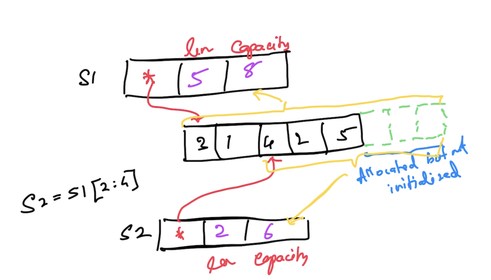

# Go Foundation

## Magesh Kuppan
- tkmagesh77@gmail.com

## Schedule
| What | When |
|------|------|
|Commence | 09:30 AM |
|Tea Break | 11:00 AM (15 mins)|
|Lunch Break | 01:00 PM (1 hour) |
|Tea Break  | 03:15 PM (15 mins) |
|Wind up | 04:30 PM |

## Repository
- https://github.com/tkmagesh/nutanix-gofoundation-aug-2024

## Software Requirements
- Go Tools (https://go.dev/dl)
- Any Editor
- Git Client

## Methodology
- No powerpoint
- No dedicate time Q & A
- Pls unmute yourself and speak anytime

## Why Go?
- Simplicity
    - ONLY 25 keywords
    - No access modifiers (private/public/protected etc)
    - No classes (only structs)
    - No inheritance (only composition)
    - No reference types (everything is a value in Go)
    - No pointer arithmatic
    - No exceptions (ONLY errors which are just values)
    - No try..catch..finally construct
    - No implicit type conversion
- Cloud Native
- Performance
    - Close to hardware
    - Compile to native code
    - Support for cross compilation
- Concurrency
    - Managed Concurrency (vs OS Thread based)
    - Cheap
    - Concurrency support is built IN the language
        - "go" keyword, "channel" data type, channel "<-" operator, "range" & "select-case" constructs
        - standard library APIs
            - "sync" package
            - "sync/atomic" package

## Go Lang
### Data Types
- bool
- string
- integers
    - int8
    - int16
    - int32
    - int64
    - int
- unsigned integers
    - uint8
    - uint16
    - uint32
    - uint64
    - uint
- floating points
    - float32
    - float64
- complex numbers
    - complex64 (real[float32] + imaginary[float32])
    - complex128 (real[float64] + imaginary[float64])
- type alias
    - byte
    - rune (unicode code point)

#### Zero values

| type | value |
| -------|-------- |
| int, uint, float | 0 |
| string | "" |
| bool | false |
| func | nil |
| struct | struct instance |
| pointer |nil |
| interface | nil | 

## Build & Execute
```
go run [file_name.go]
```
## Create a build
```
go build [file_name.go]
```
## To list the env variables for the go tool
```
go env
```
```
go env [var_1] [var_2] ....
```
## Env variables for cross compilation
```
go env GOOS GOARCH
```
## TO list the supported platforms (for cross compilation)
```
go tool dist list
```
## Cross compilation
```
GOOS=[supported os] GOARCH=[supported processor arch] go build [file_name.go]
ex:
GOOS=windows GOARCH=amd64 go build 01-hello-world.go
```

## Functions
### Higher Order Functions (functions as data)
- Functions can be assigned as values to variables
- Functions can be passed as arguments to other functions
- Functions can be returned as return values from other functions

## Collections
### Array
- Fixed sized typed collection
- Index based access
- Use len() to get the count
- Can be iterated using for-range construct
### Slice
- Varying sized typed collection
- Index based access
- Use len() to get the count
- can be initialized using "make" function
- Use append() to add new items
- Can be iterated using for-range construct


### Map
- Typed collection of key-value pairs
- Key based access
- Use len() to get the count
- can be initialized using "make" function
- should be initialized before adding data to the map
- Use delete() to remove a key/value pair 
- Can be iterated using for-range construct

## Errors
- errors are values returned from a function
- by convention, errors are objects implementing "error" interface
- "error" interface
    - Error() string
- Creating an error
    - errors.New()
    - fmt.Errorf()
    - custom type implementing "error" interface
- by convention the error is the last value of return results

## Deferred Functions
- postpone (or defer) the execution of the function until the current function execution is completed

## Panic & Recovery
### Panic
- represents the state of the application where the application execution annot proceed further
- Use panic() function to raise a panic
- typically, a panic is raised with an error

### Recovery
- Use the recover() to access the error that led to the panic

